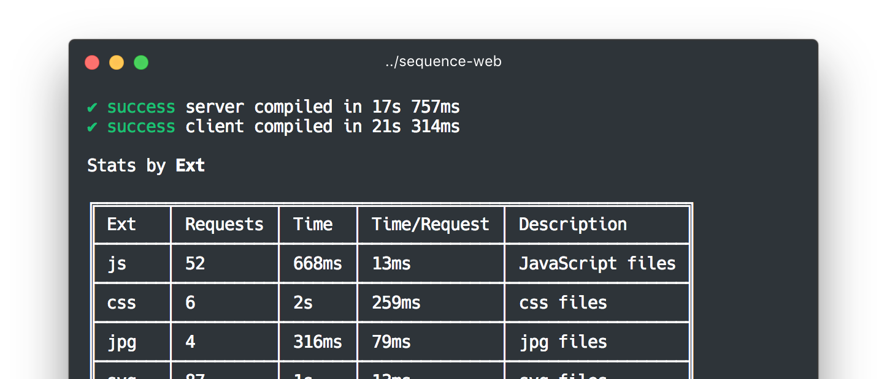

<div align="center">
<p>
<a href="https://github.com/zeit/next.js">Next.js</a> +
<a href="https://github.com/nuxt/webpackbar">WebpackBar</a>
</p>
<p>

</p>
</div>

<br>
<br>

### Installation

```
yarn add next-progressbar
```

### Usage

Edit your next config :

```js
// next.config.js
const withProgressBar = require('next-progressbar')

module.exports = withProgressBar({
  // rest of your next config
})
```

### Configuration

You can configure this plugin. The options are passed down to webpackbar.

For more information, [have a look at the options available for webpackbar](https://github.com/nuxt/webpackbar#options).

For example, you can enable the profiler :

<div align="center">
<p>

</p>
</div>

```js
// next.config.js
const withProgressBar = require('next-progressbar')

module.exports = withProgressBar({
  progressBar: {
    profile: true
  }
  // rest of your next config
})
```
