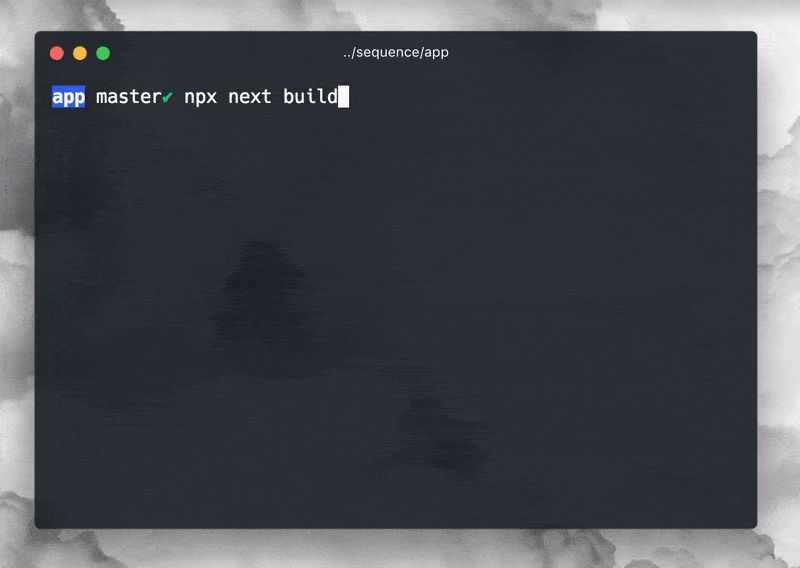

## next-progressbar

[Next.js](https://github.com/zeit/next.js) + [WebpackBar](https://github.com/nuxt/webpackbar)



### Installation

```
yarn add next-progressbar
```

### Usage

Edit your next config :

```js
// next.config.js
const withProgressBar = require('next-progressbar')

module.exports = withProgressBar({
  // rest of your next config
})
```
